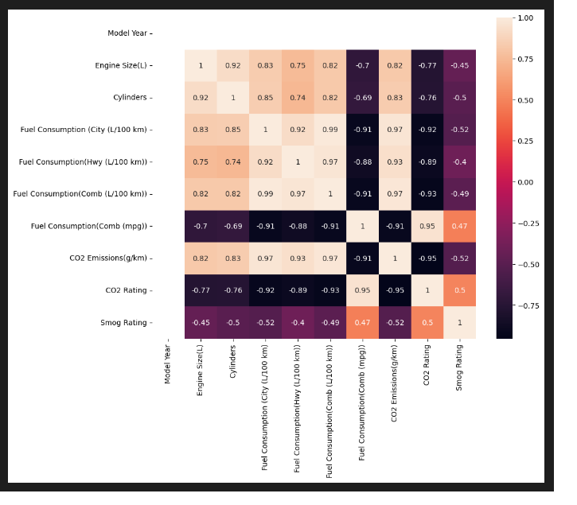
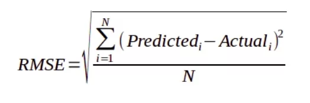
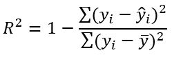

# Laporan Proyek Machine Learning

### Nama : Innayah Azizah Latifah

### Nim : 211351067

### Kelas : TIF Pagi A

## Domain Proyek


Menghitung dan meminimalisasi emisi karbon dioksida (CO2) dari kendaraan memiliki dampak penting pada lingkungan dan kesehatan manusia. Pencemaran udara akibat gas buang kendaraan, termasuk CO2, dapat menyebabkan masalah pernapasan dan berkontribusi pada perubahan iklim. Paparan jangka panjang terhadap polusi udara meningkatkan risiko penyakit kardiovaskular dan gangguan pernapasan. Dengan adanya program yang berbasis machine learning yang dapat menghitung jumlah karbon dioksida yang dihasilkan kendaraan, harapannya dapat membantu kita memahami efisiensi energi kendaraan dan memilih opsi transportasi yang lebih ramah lingkungan untuk mengurangi dampak buruk dari emisi karbon dioksida yang dihasilkan kerndaraan.

## Business Understanding

### Problem Statements

- Pencemaran udara akibat emisi CO2 yang dihasilkan kendaraan dapat menimbulkan dampak buruk bagi makhluk hidup dan lingkungan.

### Goals

- Masyarakat dapat mengetahui jumlah karbon dioksia yang dihasilkan kendaraan apakah termasuk baik atau sudah berbahaya dengan spesifikasi tertentu.

### Solution statements

- Membangun suatu sistem yang dapat mempelajari suatu data (Machine Learning) melakukan estimasi angka rating emisi CO2 pada kendaraan
- Sistem berjalan dengan menggunakan metode Regresi Linear yang dinilai cocok untuk melakukan estimasi.

## Data Understanding

Dataset yang digunakan berasal dari situs Kaggle. Dataset ini mengandung 946 entries dan 14 columns<br>

Link Dataset: [Dataset CO2 Rating](https://www.kaggle.com/datasets/rinichristy/2022-fuel-consumption-ratings/data).

### Variabel-variabel yang terdapat pada Dataset adalah sebagai berikut:

- Model Year = Tahun Pembuatan
- Make = Nama Manufaktur
- Model = Model Kendaraan
- Vehicle Class = jenis kendaraan
- Engine Size(L) = Ukuran mesin dalam liter.
- Cylinders = Ukuran diameter silinder mesin.
- Transmission = jenis transmisi.
- FUEL Type = jenis bahan bakar.
- Fuel Consumption (City (L/100 km) = konsumsi bahan bakar oleh kendaraan dalam kondisi berhenti dan berjalan di kota.
- Fuel Consumption(Hwy (L/100 km)) = mengacu pada konsumsi bahan bakar oleh kendaraan saat berada di jalan raya atau kondisi perjalanan dengan kecepatan yang lebih tinggi.
- Fuel Consumption(Comb (L/100 km)) = konsumsi bahan bakar oleh kendaraan dalam kondisi kombinasi atau campuran dari perjalanan di kota dan di jalan raya.
- Fuel Consumption(Comb (mpg)) = konsumsi bahan bakar oleh kendaraan dalam kondisi kombinasi atau campuran dari perjalanan di kota dan di jalan raya. Satuan pengukuran yang digunakan adalah miles per gallon (mpg).
- CO2 Emissions(g/km) = gas yang dikeluarkan dari hasil pembakaran senyawa yang mengandung karbon, seperti CO2, solar, LPJ, dan bahan bakar lainnya.
- CO2 Rating = mengacu pada penilaian atau peringkat emisi karbon dioksida (CO2) yang dihasilkan oleh suatu kendaraan. Peringkat ini memberikan informasi tentang seberapa ramah lingkungan kendaraan dalam hal emisi CO2. Semakin rendah nilai CO2 rating, semakin baik kendaraan dalam mengurangi dampaknya terhadap perubahan iklim dan lingkungan
- smog rating = mengacu pada penilaian atau peringkat kualitas asap yang dihasilkan oleh suatu kendaraan. Peringkat ini memberikan informasi tentang seberapa ramah lingkungan kendaraan dalam asap kendaraan. Semakin rendah nilai smog rating, semakin baik kendaraan dalam mengurangi dampaknya terhadap perubahan iklim dan lingkungan

## Data Preparation

Pertama-tama import semua library yang dibutuhkan,

```bash
import pandas as pd
import numpy as np
import matplotlib.pypot as plt
import seaborn as sns
```

Setelah itu kita akan men-definsikan dataset menggunakan fungsi pada library pandas

```bash
df = pd.read_csv('MY2022 Fuel Consumption Ratings.csv')
pd.set_option('display.max_columns', None)
```

Lalu kita akan melihat informasi mengenai dataset dengan syntax seperti dibawah:

```bash
df.info()
```

Dengan hasil sebagai berikut:

```bash
<class 'pandas.core.frame.DataFrame'>
RangeIndex: 946 entries, 0 to 945
Data columns (total 15 columns):
 #   Column                             Non-Null Count  Dtype
---  ------                             --------------  -----
 0   Model Year                         946 non-null    int64
 1   Make                               946 non-null    object
 2   Model                              946 non-null    object
 3   Vehicle Class                      946 non-null    object
 4   Engine Size(L)                     946 non-null    float64
 5   Cylinders                          946 non-null    int64
 6   Transmission                       946 non-null    object
 7   Fuel Type                          946 non-null    object
 8   Fuel Consumption (City (L/100 km)  946 non-null    float64
 9   Fuel Consumption(Hwy (L/100 km))   946 non-null    float64
 10  Fuel Consumption(Comb (L/100 km))  946 non-null    float64
 11  Fuel Consumption(Comb (mpg))       946 non-null    int64
 12  CO2 Emissions(g/km)                946 non-null    int64
 13  CO2 Rating                         946 non-null    int64
 14  Smog Rating                        946 non-null    int64
dtypes: float64(4), int64(6), object(5)
memory usage: 111.0+ KB
```

<br>

Kita juga akan melihat tingkat korelasi antar kolom



Korelasi antar kolom perlu diperhatikan guna memilih feature dengan tepat.

Selanjutnya memeriksa apakah ada data yang berisi nilai null pada dataset:

```bash
df.isna().sum()
```

Dengan hasil sebagai berikut:

```bash
Model Year                           0
Make                                 0
Model                                0
Vehicle Class                        0
Engine Size(L)                       0
Cylinders                            0
Transmission                         0
Fuel Type                            0
Fuel Consumption (City (L/100 km)    0
Fuel Consumption(Hwy (L/100 km))     0
Fuel Consumption(Comb (L/100 km))    0
Fuel Consumption(Comb (mpg))         0
CO2 Emissions(g/km)                  0
CO2 Rating                           0
Smog Rating                          0
dtype: int64
```

 <br>

Tidak terdapat objek null pada dataset sehingga kita tidak perlu melakukan cleansing pada dataset.

### Merubah nama kolom

Jika dilihat pada dataset, terdapat beberpa nama kolom yang masih memiliki spasi dan kurung didalamnya, hal itu akan mengganggu proses development program karena karakter spasi dan kurung akan terbaca sebagai syntax oleh system python. Oleh karena itu kita akan merubahnya agar menjadi lebih simple.

```bash
df.rename(columns = {"Fuel Consumption(Comb (mpg))":"fuel_consumption_mpg"},inplace=True)
df.rename(columns = {"Model Year":"model_year","Engine Size(L)":"engine_size","Fuel Consumption (City (L/100 km)":"fuel_consumption_city","Fuel Consumption(Hwy (L/100 km))":"fuel_consumption_hwy","Fuel Consumption(Comb (L/100 km))":"fuel_consumption_comb","CO2 Emissions(g/km)":"co2_emisi"},inplace=True)
```

### Membuat feature

Setelah seluruh kolom tidak memiliki nilai null dan memiliki nama kolom yang simple dan tidak mengandung syntax/tag python, selanjutnya kita akan membuat feature dan target dari dataset tersebut.
Feature digunakan sebagai parameter menghitung hasil estimasi/prediksi yang diharapkan. Hasil estimasi di dataset ini adalah kolom co2_rating. Untuk membuat feature dan target dengan codingan sbgai berikut:

```bash
features = ['model_year','engine_size','Cylinders','fuel_consumption_city','fuel_consumption_hwy','fuel_consumption_comb','fuel_consumption_mpg','co2_emisi']
x = df[features]
y = df['co2_rating']
x.shape, y.shape
```

### Split Dataset untuk Training dan Testing

Ketika akan melakukan proses perhitungan dengan metode regresi linear, maka dataset harus dibagi menjadi dua jenis yaitu training dan testing. Split dataset menggunakan fungsi train_test_split.

```bash
from sklearn.model_selection import train_test_split
x_train, x_test, y_train, y_test = train_test_split(x,y,random_state=34,test_size=0.1)
y_test.shape
x_train.shape
```

Disini kita mendapatkan 851 data untuk data training, dan 98 data untuk data
tesing.

## Modeling

Pada tahap modeling, kita akan menggunakan metode Regresi Linear yang sudah kita import melalui library sklearn.

```bash
from sklearn.linear_model import LinearRegression
lr = LinearRegression()
lr.fit(x_train,y_train)
pred = lr.predict(x_test)
```

Lalu berikut adalah skor akurasi dari model yang kita buat

```bash
score = lr.score(x_test,y_test)
print('Akurasi model Regresi Linear', score)
```

> Akurasi model Regresi Linear 0.9401624183940697

## Evaluation

Metrik evaluasi yang digunakan adalah **RMSE** dan **R2**,
**RMSE** adalah singkatan dari **Root Mean Square Error**.
Metrik ini menghitung perbedaan antara nilai aktual dan nilai prediksi, kemudian menghitung akar kuadrat dari rata-rata selisih kuadrat tersebut. Semakin kecil nilai RSME, semakin baik kualitas model regresi tersebut. Metode **R-square** ini merupakan metode yang paling sering digunakan. Metode ini akan memberikan bobot sangat tinggi untuk kesalahan absolut besar. Oleh karena itu, nilai R2 yang




Mari kita implementasi metrik evaluasi R-Square dan RSME pada model yang telah kita bangun:

```bash
from sklearn.metrics import r2_score
from sklearn.metrics import mean_squared_error

print('R2:', r2_score(y_test,pred))
print('RMSE:', np.sqrt(mean_squared_error(y_test, pred)))
```

> R2: 0.9401624183940697 <br>
> RMSE: 0.3593279452114029

Didapatkan hasil **R2** sebesar R2: 0.9401624183940697 dan **RMSE** sebesar 0.3593279452114029. Dengan hasil seperti itu maka model yang kita gunakan sudah cukup layak.

## Deployment

Link Streamlit: https://app-estimasi-rating-co2-kendaraan-9rbvp3fvvp3tct35elfvly.streamlit.app/
